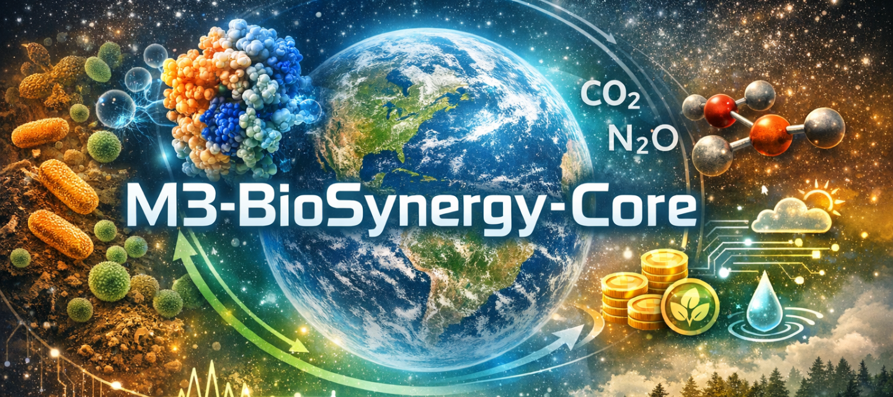

# **M3‑BioSynergy‑Core**

### _The Core Engine of the Planetary Metabolic Operating System (Planetary OS)_

**M3‑BioSynergy‑Core** is the scientific and computational core of the Planetary OS architecture.  
It integrates:

- Microbial hypercycles (MBT55)
- Enzyme cascade acceleration
- Carbon & nitrogen flux modeling
- Field data (CSV datasets)
- UNFCCC‑aligned climate finance
- Multi‑sector ecological applications

This repository contains the **core models, datasets, documentation, and white paper** that define the M3‑BioSynergy Engine.

---

# **📁 Repository Structure**

```
M3-BioSynergy-Core/
│
├── 1_Theory/                 # Scientific foundations (Gaia, MBT55, hypercycles)
│
├── 2_Models/                 # Fully functional Python models
│   ├── microbial_dynamics.py
│   ├── enzyme_cascade.py
│   ├── carbon_flux.py
│   ├── nitrogen_flux.py
│   ├── hypercycle.py
│   └── run_demo.py           # ← Executable demo (matplotlib graph)
│
├── 3_Data/                   # CSV datasets + documentation
│   ├── MBT55_Composition.csv
│   ├── MBT55_Composition.md
│   ├── Enzyme_Activity.csv
│   ├── Enzyme_Activity.md
│   ├── Soil_Improvement.csv
│   ├── Soil_Improvement.md
│   ├── GHG_FieldData.csv
│   ├── GHG_FieldData.md
│   ├── HeavyMetal_Transformation.csv
│   └── HeavyMetal_Transformation.md
│
├── 4_Applications/           # Sector-specific deployment modules
│   ├── AGRIX.md
│   ├── Coffee_Industry.md
│   ├── Water_Purification.md
│   ├── ForestFire_Prevention.md
│   └── HealthBook.md
│
├── 5_ClimateFinance/         # UNFCCC-aligned climate finance architecture
│   ├── Carbon_Credit_Methodology.md
│   ├── PBPE_Tokenomics.md
│   ├── Claim_Engine_Architecture.md
│   ├── UNFCCC_Alignment.md
│   └── Government_Proposal_Framework.md
│
├── 6_Diagrams/               # Structured specifications for PNG generation
│   ├── Gaia_MBT55_Integration.md
│   ├── Ecological_Hypercycle.md
│   ├── Enzyme_Cascade.md
│   ├── Carbon_Cycle_Acceleration.md
│   ├── Nitrogenase_Transformation.md
│   └── Climate_Finance_Architecture.md
│
└── WhitePaper/
    └── WhitePaper.md         # Full Planetary OS White Paper (v1.0)
```

---

# **🚀 Running the Hypercycle Demo**

### Requirements

```
python 3.9+
numpy
matplotlib
```

### Run

```
python 2_Models/run_demo.py
```

This generates a graph showing:

- Microbial biomass
- Carbon flux
- Nitrogen flux

over time.

---

# **📊 Executable Python Models**

|Model|File|Status|Description|
|---|---|---|---|
|Microbial Dynamics|microbial_dynamics.py|✅ Working|Logistic growth + substrate + enzyme enhancement|
|Enzyme Cascade|enzyme_cascade.py|✅ Working|Multi-step Michaelis–Menten cascade|
|Carbon Flux|carbon_flux.py|✅ Working|Carbon mineralization & stabilization|
|Nitrogen Flux|nitrogen_flux.py|✅ Working|Nitrogen fixation & flux dynamics|
|Hypercycle Integration|hypercycle.py|✅ Working|Full system integration|
|Hypercycle Demo|run_demo.py|✅ Working|Graph output (matplotlib)|

---

# **📁 Data Layer (CSV + Documentation)**

All datasets follow the M3‑BioSynergy standard:

- **CSV = data**
- **MD = Data Dictionary + Model Integration + Usage**

This ensures transparency, reproducibility, and UNFCCC‑aligned MRV.

---

# **🌱 Applications**

- AGRIX (Regenerative Agriculture)
- Coffee Industry Transformation
- Water Purification
- Forest Fire Prevention
- Environmental Health (HealthBook)

---

# **💰 Climate Finance (UNFCCC‑Aligned)**

Includes:

- Carbon credit methodology
- PBPE tokenomics
- Claim Engine architecture
- Verification (ISO 14064‑2, IPCC)
- Government proposal framework

---

# **📘 White Paper**

Full White Paper:

```
WhitePaper/WhitePaper.md
```

---

## **📩 Contact**

**Kaz Shimojo**  
Co-Founder & Chief Architect, BioNexus Holdings

---
---

# 📘 **Soil–Carbon–Finance Dashboard (Streamlit Application)**

_A Planetary OS Soil Module Demonstration_

The **Soil–Carbon–Finance Dashboard** is an interactive Streamlit application that visualizes:

- Soil carbon dynamics
- MBT55 project scenarios
- Carbon sequestration
- Yield improvement
- Green Premium (climate finance)
- MRV (Measurement, Reporting, Verification)
- Planetary OS Soil Module Export (standardized JSON)

This dashboard is fully bilingual (**English ↔ Japanese**) and is designed for:

- Researchers
- Climate finance analysts
- Regenerative agriculture projects
- Government proposal teams
- Planetary OS integration partners

---

## 🌍 **Features**

### **1. Overview (Baseline vs MBT55 Scenario)**

- Annual carbon sequestration
- Additional sequestration (difference)
- Carbon credit revenue
- Total Green Premium

### **2. Soil & Microbes**

- SOC (Soil Organic Carbon)
- Microbial biomass
- Substrate
- Soil stability

### **3. Carbon Module**

- Annual carbon sequestration flow
- Baseline vs MBT55 comparison

### **4. Finance Module**

- Carbon credit revenue
- Yield improvement revenue
- Total Green Premium
- Project-level aggregation

### **5. MRV Module**

- Upload observed CSV/Excel
- Automatic alignment with model output
- RMSE, Bias, R²
- Full MRV JSON report

### **6. Planetary OS Export**

- Generates standardized JSON for  
    **Planetary OS Soil Module**
- Includes baseline, project, and scenario metadata

---

## 🔤 **Language Switching (English ↔ Japanese)**

The dashboard includes a built‑in language toggle:

```
[ 日本語 ]   [ English ]
```

All UI elements switch instantly:

- Sidebar
- Tabs
- Metrics
- Charts
- MRV labels
- Export descriptions

---

## 🚀 **How to Run the Dashboard**

### **1. Install dependencies**

```
pip install streamlit pandas numpy
```

### **2. Run the app**

```
streamlit run app.py
```

### **3. Open in browser**

Streamlit will show:

```
Local URL: http://localhost:8501
```

Click to open.

---

## 📁 **File Structure**

```
app.py                     # Unified bilingual dashboard
core_model.py              # Soil carbon model
mrv.py                     # MRV engine
planetary_os_adapter.py    # Planetary OS JSON export
```

---

## 🧠 **Model Logic**

The dashboard runs two scenarios:

- **Baseline** (mbt_dose = 0.0)
- **Project (MBT55)** (mbt_dose = user-defined)

Outputs include:

- SOC
- Carbon sequestration
- Yield
- Microbial biomass
- Substrate
- Soil stability

---

## 🌐 **Planetary OS Integration**

The dashboard exports a JSON structure compatible with:

- **Planetary OS Soil Module**
- **UNFCCC-aligned climate finance workflows**
- **PBPE tokenization**
- **Claim Engine architecture**

This ensures interoperability with:

- Governments
- Research institutions
- Carbon registries
- Planetary OS Core

---

## 📸 **Screenshots (to be added)**

You can add screenshots here:

```
assets/dashboard_overview.png
assets/dashboard_soil.png
assets/dashboard_mrv.png
assets/dashboard_export.png
```

